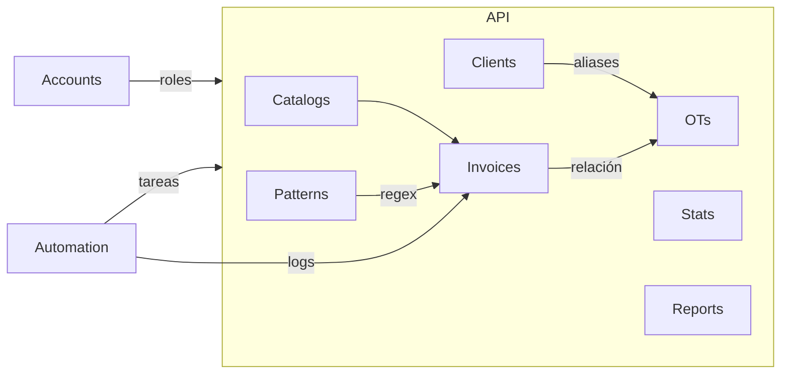

# 📗 Documento Completo — Sistema de Control de Facturas y OTs (Versión Django)

Este documento define el blueprint integral para construir, en Django + DRF, una versión mejorada del sistema actual de OTs y facturas. Reusa lo que ya funciona (columnas, reglas clave, jerarquías) y agrega automatización, mejor arquitectura, y procesamiento de correos Outlook (incluye buzón compartido).

# La app se llamará NextOps

## 🎯 Resumen ejecutivo

-   Problema actual

    -   ~5 horas diarias en operaciones manuales (registro, búsquedas, vinculación).
    -   Duplicación con contabilidad y riesgo de errores.
    -   Alto volumen de facturas DTE y de navieras con procesamiento manual.
    -   Búsqueda manual en correos para hallar OTs relacionadas.

-   Objetivos del nuevo sistema

    -   Automatizar ≥ 70% del registro de facturas (en especial DTE).
    -   Reducir trabajo manual 5h → 2h diarias.
    -   Unificar fuente de verdad, eliminando duplicación con contabilidad.
    -   Matching inteligente Factura ↔ OT con trazabilidad y confianza.
    -   Interfaz moderna, rápida y ergonómica (reorganizar tabla de OTs, mantener columnas claves, mejorar distribución de información).

Métricas actuales y baseline

-   Volumen diario estimado: 10–15 facturas/día (≈50/semana), 10 OTs nuevas/semana.
-   Duplicados actuales: medir % de PDFs repetidos la primera semana para baseline.
-   Errores de vinculación: medir % de facturas mal asignadas (baseline inicial).
-   Tiempo manual: ~5 h/día (objetivo: ≤ 2 h/día al mes 1).

Flujo de datos (alto nivel)
Outlook/Shared Mailbox → Ingesta (Celery/Graph) → Extracción (PDF/JSON) → Matcher → Invoice → Vinculación OT → UI (pendientes/aprobadas) → Exportes/Contabilidad.
Nota: Diagrama visual (mermaid/draw.io) a adjuntar para stakeholders.

-   Usuarios y roles
    -   Usuario principal (tú): acceso completo, foco en ingestión/validación.
    -   Jefa de operaciones: supervisión y aprobaciones.
    -   Contabilidad: vistas/reportes sin duplicar trabajo.
    -   Sistema automático: monitoreo de buzón, extracción, matching, alertas.

## 🧱 Stack tecnológico propuesto

-   Frontend (se mantiene)

    -   React 18 + Vite 5, TailwindCSS, React Router DOM v6.
    -   shadcn/ui + Radix (componentes modernos), React Hook Form + Zod, React Query (TanStack Query).
    -   Axios, recharts, date-fns, xlsx.
    -   Despliegue: Vercel.

-   Backend (nuevo)

    -   Django 5.1.x + Django REST Framework 3.15.x.
    -   Autenticación: SimpleJWT 5.3.x (djangorestframework-simplejwt).
    -   Tareas asíncronas: Celery 5.3.x + Redis 7.x (Upstash o Redis gestionado).
    -   Base de datos: PostgreSQL 15+ (Neon). Driver psycopg2.
    -   Migraciones: nativas de Django.
    -   E-mail/Outlook: Microsoft Graph API (msal o O365-REST-Python-Client). Fallback IMAP OAuth2 si fuera necesario.
    -   Procesamiento: pdfplumber, pytesseract (opcional), pandas + openpyxl.
    -   CORS: django-cors-headers. Filtros: django-filter 24.x.
    -   Documentación API: drf-spectacular 0.27.x (OpenAPI/Swagger).
    -   Opcional realtime: Django Channels 4.x para notificaciones instantáneas.
    -   Logging estructurado: dictConfig + RotatingFileHandler (logs/app.log, logs/errors.log).

-   Infraestructura y DevOps
    -   Despliegue: Render o Railway (web dyno + worker Celery + beat). Vercel para frontend.
    -   Redis: Upstash (plan gratuito), Postgres: Neon.
    -   Almacenamiento: sistema de archivos (persistente) y/o OneDrive/SharePoint vía Graph (opcional).
    -   CI/CD: GitHub Actions (lint, test, build, deploy). Health checks, métricas básicas.

## 🏗️ Arquitectura Django y estructura del proyecto

```
proyecto-facturas/
│
├── backend/
│   ├── manage.py
│   ├── proyecto/                      # Django project
│   │   ├── __init__.py
│   │   ├── settings/
│   │   │   ├── base.py                # Config común (INSTALLED_APPS, DB, CORS)
│   │   │   ├── dev.py                 # DEBUG, CORS local, mail sandbox
│   │   │   └── prod.py                # Seguridad, caching, logging prod
│   │   ├── urls.py                    # /api/* → routers DRF
│   │   ├── asgi.py                    # ASGI (channels opcional)
│   │   └── wsgi.py
│   │
│   ├── common/                        # Código compartido
│   │   ├── models.py                  # AbstractBase, TimeStamped, SoftDelete (opcional)
│   │   ├── utils.py                   # Hash, fecha, normalizadores
│   │   ├── permissions.py             # RoleRequired, IsAdmin...
│   │   └── pagination.py              # Paginación por defecto
│   │
│   ├── accounts/                      # Usuarios y roles
│   │   ├── models.py                  # User (custom), Role enum
│   │   ├── serializers.py
│   │   ├── views.py                   # /auth/login, /auth/me
│   │   ├── urls.py
│   │   └── services.py                # Cambio de contraseña, etc.
│   │
│   ├── catalogs/                      # Proveedores, CostTypes, Categorías
│   │   ├── models.py
│   │   ├── serializers.py
│   │   ├── views.py
│   │   └── urls.py
│   │
│   ├── patterns/                      # Patrones Regex (similar a actual)
│   │   ├── models.py                  # RegexPattern, PatternCategory
│   │   ├── serializers.py
│   │   ├── views.py                   # CRUD, test, stats
│   │   └── urls.py
│   │
│   ├── clients/                       # Aliases de clientes
│   │   ├── models.py                  # ClientAlias
│   │   ├── serializers.py
│   │   ├── views.py                   # CRUD, sugerencias
│   │   └── urls.py
│   │
│   ├── ots/                           # Órdenes de Trabajo
│   │   ├── models.py                  # OT (mejorado, JSONField)
│   │   ├── serializers.py
│   │   ├── views.py                   # CRUD, búsqueda avanzada
│   │   ├── urls.py
│   │   ├── excel_processor.py         # Reutiliza heurísticas actuales
│   │   └── provision_manager.py       # Jerarquía MANUAL>CSV>EXCEL
│   │
│   ├── invoices/                      # Facturas (navieras y otros)
│   │   ├── models.py                  # Invoice, UploadedFile
│   │   ├── serializers.py
│   │   ├── views.py                   # CRUD, upload, export, pendientes
│   │   ├── urls.py
│   │   └── parsers/
│   │       ├── dte_json.py            # Parser DTE estándar SV
│   │       ├── pdf_extractor.py       # Texto PDF, OCR opcional
│   │       └── matcher.py             # Motor de matching multi-nivel
│   │
│   ├── automation/                    # Automatización y correo
│   │   ├── models.py                  # EmailProcessingLog, ProcessingQueue
│   │   ├── tasks.py                   # Celery tasks (buzón, alertas)
│   │   ├── email_monitor.py           # Integración Graph/IMAP
│   │   └── urls.py                    # Hooks manuales (opcional)
│   │
│   ├── workers/
│   │   ├── celery.py                  # Celery app init
│   │   └── schedules.py               # Beat schedules
│   │
│   ├── templates/                     # Admin, emails (opcional)
│   ├── requirements.txt
│   ├── Dockerfile
│   └── render.yaml
│
├── docker-compose.yml                 # Dev: Postgres + Redis + backend
└── frontend/                          # React (proyecto aparte o monorepo)
```

-   Enrutamiento API: `proyecto/urls.py` incluye `api/` → routers DRF de cada app.
-   Settings con capas (base/dev/prod) para separar CORS, DEBUG, logging y secrets.
-   Celery: `workers/celery.py` auto-descubre tasks en apps; `schedules.py` para cron.

Diagrama de módulos (alto nivel)

-   accounts, catalogs, clients, patterns, ots, invoices, automation.
    Relaciones: invoices → ots; automation → invoices (logs); catalogs/providers ↔ invoices; clients/aliases ↔ ots/invoices.
    Nota: se añadirá un diagrama visual en la carpeta de diseño.

## 🧩 Diagramas (Mermaid)

### Flujo de datos (alto nivel)

```mermaid
flowchart LR
    A[Outlook/Shared Mailbox] --> B[Ingesta Celery / Graph]
    B --> C[Extracción PDF/JSON]
    C --> D[Matcher (regex + heurísticas)]
    D --> E[Invoices]
    E --> F[Asignación a OT]
    F --> G[UI: Pendientes/Aprobadas]
    G --> H[Exportes / Contabilidad]
```

### Módulos y relaciones



## 🗄️ Modelos de datos (Django ORM, PostgreSQL)

A continuación, el mapeo de los modelos clave, manteniendo y mejorando las columnas actuales. Se usarán índices y JSONB donde aporte performance.

-   User (accounts.User)

    -   id (PK), username (unique), email (unique), password (hash), full_name
    -   role: ChoiceField [admin, jefe_operaciones, finanzas, operativo]
    -   is_active, created_at, updated_at
    -   Índices: (username), (email)

-   OT (ots.OT) — Mejorado

    -   id (PK), ot_number (unique, index) — p.ej. 25OT221
    -   cliente (index), consignatario_shipper, operativo
    -   hbl, mbl (index)
    -   contenedores: JSONField (array de strings) + GIN index
    -   cantidad_contenedores: Integer
    -   tipo_embarque, naviera, barco
    -   puerto_salida, puerto_arribo, destino_final_embarque
    -   etd (date), eta (date index), fecha_atraque (date), recepcion_ot (date)
    -   fecha_provision (date), provision_source (enum: MANUAL/CSV/EXCEL), provision_locked (bool), provision_updated_by (str)
    -   estado_ot, estado_provision, estado_facturacion
    -   alerta_almacenaje (bool), alerta_demora (bool)
    -   comentarios (Text)
    -   created_at, updated_at
    -   Relaciones: facturas → Invoice (reverse FK)
    -   Índices: (ot_number unique), (mbl), (eta), GIN(contenedores)

-   Provider (catalogs.Provider)

    -   id, nombre (unique), nit, tipo (naviera, transporte, aduana, agente)
    -   email (para identificación desde correo)
    -   requiere_contenedor (bool), requiere_bl (bool), proveedor_categoria (local/internacional)
    -   is_active, created_at

-   Invoice (invoices.Invoice)

    -   id (PK)
    -   Vinculación con OT
        -   ot (FK → ots.OT, null=True), ot_number (denormalizado)
    -   Proveedor
        -   proveedor_nit, proveedor_nombre, tipo_proveedor, proveedor_categoria
    -   Factura
        -   numero_factura (unique), fecha_emision, fecha_vencimiento (null)
        -   monto (Decimal) [USD fijo], tipo_costo (FLETE, TRANSPORTE, ADUANA, ALMACENAJE, ...)
    -   Detección automática
        -   referencias_detectadas: JSONField { mbl, contenedor, ot, barco, fecha_eta }
        -   confianza_match (Float), assignment_method (Choice)
        -   requiere_revision (Bool)
    -   Estados y fechas
        -   estado_provision (pendiente/provisionada/rechazada), fecha_provision
        -   estado_facturacion (pendiente/facturada), fecha_facturacion
    -   Archivo
        -   file_path, file_hash (unique), file_size
    -   Procesamiento
        -   processed_at, processed_by, processing_source (email_auto/upload_manual/csv_import)
    -   Metadata
        -   created_at, updated_at, notas
    -   Índices: (numero_factura unique), (file_hash unique), (ot_number), (fecha_emision)

-   UploadedFile (invoices.UploadedFile)

    -   id, filename, path, sha256 (unique), size, content_type
    -   related_invoice (OneToOne, opcional), created_at

-   RegexPattern (patterns.RegexPattern)

    -   id, name, pattern, flags, target_field, categoria, prioridad
    -   stats (JSONField), is_active, created_at, updated_at

-   ClientAlias (clients.ClientAlias)

    -   id, nombre_principal, alias_corto, variantes (JSON), threshold, auto_generated, is_active, usage_count

-   EmailProcessingLog (automation.EmailProcessingLog)
    -   id, message_id (unique), subject, sender, received_at
    -   status (pending/p
        rocessed/error/skipped), invoice (FK nullable), error_message, retry_count
    -   processed_at, processing_time_ms, attachments_count, has_json, has_pdf
    -   Índices: (message_id unique), (received_at DESC)

Notas técnicas:

-   Usar `django.contrib.postgres.indexes.GinIndex` para JSONB (contenedores).
-   Validar `ot_number` vía regex en serializer y/o clean().
-   Señalar `provision_source` y `provision_locked` para jerarquía de provisión.

Campos obligatorios/opcionales (UI)

-   OTs: obligatorios → ot_number, cliente; opcionales → consignatario_shipper, operativo, hbl, mbl, contenedores, tipo_embarque, naviera, barco, puertos, fechas, comentarios.
-   Facturas (upload): obligatorios → proveedor_nombre, numero_factura, fecha_emision, monto, tipo_costo; opcionales → proveedor_nit, fecha_vencimiento, ot_number, notas.

Longitudes máximas (recomendación)

-   username 150, email 254, full_name 255; ot_number 32; hbl/mbl 64; naviera/barco/puertos/destino 120; proveedor_nombre 255; numero_factura 64; file_hash 128; file_path 1024.

Ejemplos JSONB

-   OTs.contenedores: ["MSCU1234567", "ABCD9876543"]
-   Invoices.referencias_detectadas: { "mbl": "MAEU123456789", "contenedor": "MSCU1234567", "ot": "25OT221", "barco": "MSC ANNA", "fecha_eta": "2025-01-15" }

### Diccionario de Datos completo (tablas/columnas)

Esta sección define explícitamente columnas, tipos, restricciones y catálogos para construir la BD desde cero sin depender del sistema actual.

-   Tabla: accounts_user

    -   id: bigserial PK
    -   username: varchar(150) unique not null
    -   email: citext unique not null
    -   password: varchar(255) not null
    -   full_name: varchar(255) null
    -   role: varchar(32) not null check in ['admin','jefe_operaciones','finanzas','operativo']
    -   is_active: boolean default true
    -   created_at: timestamptz default now()
    -   updated_at: timestamptz default now()

-   Tabla: catalogs_provider

    -   id: bigserial PK
    -   nombre: varchar(255) unique not null
    -   nit: varchar(50) null
    -   tipo: varchar(32) not null check in ['naviera','transporte','aduana','agente']
    -   proveedor_categoria: varchar(32) not null check in ['local','internacional'] default 'local'
    -   email: citext null
    -   requiere_contenedor: boolean default false
    -   requiere_bl: boolean default false
    -   is_active: boolean default true
    -   created_at: timestamptz default now()

-   Tabla: ots_ot

    -   id: bigserial PK
    -   ot_number: varchar(32) unique not null -- regex ^\d{2}OT\d{3,4}
    -   cliente: varchar(255) not null
    -   consignatario_shipper: varchar(255) null
    -   operativo: varchar(120) null
    -   hbl: varchar(64) null
    -   mbl: varchar(64) null
    -   contenedores: jsonb not null default '[]'::jsonb -- array de strings
    -   cantidad_contenedores: int null
    -   tipo_embarque: varchar(16) null check in ['FCL','LCL']
    -   naviera: varchar(120) null
    -   barco: varchar(120) null
    -   puerto_salida: varchar(120) null
    -   puerto_arribo: varchar(120) null
    -   destino_final_embarque: varchar(120) null
    -   etd: date null
    -   eta: date null
    -   fecha_atraque: date null
    -   recepcion_ot: date null
    -   fecha_provision: date null
    -   provision_source: varchar(16) null check in ['MANUAL','CSV','EXCEL']
    -   provision_locked: boolean not null default false
    -   provision_updated_by: varchar(255) null
    -   estado_ot: varchar(32) null check in ['pendiente','en_proceso','cerrada']
    -   estado_provision: varchar(32) null check in ['pendiente','provisionada']
    -   estado_facturacion: varchar(32) null check in ['pendiente','facturada']
    -   alerta_almacenaje: boolean not null default false
    -   alerta_demora: boolean not null default false
    -   comentarios: text null
    -   created_at: timestamptz default now()
    -   updated_at: timestamptz default now()
    -   INDEX: idx_ots_ot_number unique(ot_number)
    -   INDEX: idx_ots_mbl (mbl)
    -   INDEX: idx_ots_eta (eta)
    -   GIN INDEX: idx_ots_contenedores_gin USING GIN (contenedores)

-   Tabla: invoices_invoice

    -   id: bigserial PK
    -   ot_id: bigint FK → ots_ot.id null on delete set null
    -   ot_number: varchar(32) null
    -   proveedor_nit: varchar(64) null
    -   proveedor_nombre: varchar(255) not null
    -   tipo_proveedor: varchar(32) not null check in ['naviera','transporte_local','aduana','agente_carga']
    -   proveedor_categoria: varchar(32) not null check in ['local','internacional'] default 'local'
    -   numero_factura: varchar(64) not null unique
    -   fecha_emision: date not null
    -   fecha_vencimiento: date null
    -   monto: numeric(12,2) not null -- siempre USD
    -   tipo_costo: varchar(32) not null check in ['FLETE','TRANSPORTE','ADUANA','ALMACENAJE','DEMORA','OTRO']
    -   referencias_detectadas: jsonb not null default '{}'::jsonb
    -   confianza_match: numeric(4,3) not null default 0
    -   assignment_method: varchar(32) null check in ['ot_directa','mbl_contenedor','solo_mbl','solo_contenedor','proveedor_fecha','manual','no_match']
    -   requiere_revision: boolean not null default true
    -   estado_provision: varchar(32) not null default 'pendiente' check in ['pendiente','provisionada','rechazada']
    -   fecha_provision: date null
    -   estado_facturacion: varchar(32) not null default 'pendiente' check in ['pendiente','facturada']
    -   fecha_facturacion: date null
    -   file_path: varchar(1024) not null
    -   file_hash: varchar(128) not null unique
    -   file_size: bigint not null
    -   processed_at: timestamptz null
    -   processed_by: varchar(255) not null default 'system'
    -   processing_source: varchar(32) not null check in ['email_auto','upload_manual','csv_import']
    -   notas: text null
    -   created_at: timestamptz default now()
    -   updated_at: timestamptz default now()
    -   INDEX: idx_invoices_ot_number (ot_number)
    -   INDEX: idx_invoices_fecha_emision (fecha_emision)

-   Tabla: invoices_uploadedfile

    -   id: bigserial PK
    -   filename: varchar(255) not null
    -   path: varchar(1024) not null
    -   sha256: varchar(128) not null unique
    -   size: bigint not null
    -   content_type: varchar(128) null
    -   related_invoice_id: bigint unique null FK → invoices_invoice.id on delete set null
    -   created_at: timestamptz default now()

-   Tabla: patterns_regexpattern

    -   id: bigserial PK
    -   name: varchar(255) not null unique
    -   pattern: text not null
    -   flags: int not null default 0
    -   target_field: varchar(64) not null check in ['mbl','contenedor','ot','barco','fecha_eta','cliente','proveedor','monto','numero_factura']
    -   categoria: varchar(64) null
    -   prioridad: int not null default 0
    -   stats: jsonb not null default '{}'::jsonb
    -   is_active: boolean not null default true
    -   created_at: timestamptz default now()
    -   updated_at: timestamptz default now()

-   Tabla: clients_clientalias

    -   id: bigserial PK
    -   nombre_principal: varchar(255) not null
    -   alias_corto: varchar(120) null
    -   variantes: jsonb not null default '[]'::jsonb
    -   threshold: numeric(3,2) not null default 0.7
    -   auto_generated: boolean not null default false
    -   is_active: boolean not null default true
    -   usage_count: int not null default 0

-   Tabla: automation_emailprocessinglog
    -   id: bigserial PK
    -   message_id: varchar(255) not null unique
    -   subject: text null
    -   sender: citext null
    -   received_at: timestamptz not null
    -   status: varchar(16) not null check in ['pending','processed','error','skipped']
    -   invoice_id: bigint null FK → invoices_invoice.id on delete set null
    -   error_message: text null
    -   retry_count: int not null default 0
    -   processed_at: timestamptz null
    -   processing_time_ms: int null
    -   attachments_count: int not null default 0
    -   has_json: boolean not null default false
    -   has_pdf: boolean not null default false
    -   INDEX: idx_email_received_at (received_at DESC)

Catálogos (valores iniciales sugeridos):

-   providers.tipo: ['naviera','transporte','aduana','agente']
-   providers.proveedor_categoria: ['local','internacional']
-   invoices.tipo_costo: ['FLETE','TRANSPORTE','ADUANA','ALMACENAJE','DEMORA','OTRO']
-   invoices.tipo_proveedor: ['naviera','transporte_local','aduana','agente_carga']
-   ots.tipo_embarque: ['FCL','LCL']
-   ots.estado_ot: ['pendiente','en_proceso','cerrada']
-   ots.estado_provision: ['pendiente','provisionada']
-   invoices.estado_provision: ['pendiente','provisionada','rechazada']
-   invoices.estado_facturacion: ['pendiente','facturada']

Keys y unicidad:

-   invoices.numero_factura unique, invoices.file_hash unique, accounts.email unique.
-   emails.message_id unique, uploadedfile.sha256 unique.

Validaciones clave:

-   ot_number regex: ^\d{2}OT\d{3,4}.
-   contenedor regex: ^[A-Z]{4}\d{7}$.
-   mbl regex (aprox): ^[A-Z]{4}\d{9,12}$.

Triggers sugeridos (o signals Django):

-   Before save Invoice: calcular y validar file_hash si hay archivo; denormalizar ot_number si ot_id.
-   Before save OT: normalizar contenedores (upper, dedupe), set cantidad_contenedores.

## 🤝 Reglas de negocio clave

-   Importación de OTs desde Excel (reutilizar heurísticas actuales):

    -   Detección de headers (hasta 5 filas, nombres equivalentes, early exit por score).
    -   Mapeo inteligente (OT, cliente/consignatario, HBL/MBL, naviera, puertos, fechas, contenedores, provisión...).
    -   Validaciones mínimas: `ot_number` y al menos cliente o consignatario_shipper.
    -   Normalización: contenedores (4 letras + 7 dígitos), ETA vs ATRAQUE (usar ATRAQUE si falta ETA), dedupe.
    -   Filtro por año mínimo (>= 25OT ó año corriente).
    -   Upsert: si existe y sin ediciones manuales críticas → update; si no → insert.

-   Jerarquía de “fecha de provisión” (igual que hoy):

    -   MANUAL: máxima prioridad, locked=True, no sobreescribible por CSV/EXCEL.
    -   CSV: alta prioridad, locked=True, puede cambiar manual pero no por EXCEL.
    -   EXCEL: baja prioridad, locked=False, puede ser sobreescrita por CSV/MANUAL.
    -   Endpoint de desbloqueo con confirmación para permitir sobrescrituras futuras.

-   Motor de matching de facturas ↔ OTs (multi-nivel):

    1. OT directa (95%).
    2. MBL + Contenedor (90%).
    3. Solo MBL (80%, requiere revisión).
    4. Solo Contenedor (70%, requiere revisión).
    5. Proveedor + ETA cercana ±7 días (60%, requiere revisión y sugiere alternativas).

-   Lógica de fechas por tipo de costo:
    -   FLETE/TRANSPORTE: fecha_facturación = ETA; provisión = emisión + 3 días (estimado).
    -   CARGOS EXTRA: usuario ingresa fechas manualmente; validar rango razonable.

Validaciones de negocio (fechas y montos)

-   Fechas
    -   fecha_provision ≥ fecha_emision (si ambas presentes); permitir futura.
    -   fecha_emision: alerta si > 1 año atrás; alerta si > 7 días en futuro.
    -   OTs.eta: puede ser pasado; alerta si > 365 días en futuro.
-   Montos
    -   Facturas normales: 0.01 ≤ monto ≤ 1,000,000.
    -   Notas de crédito: -1,000,000 ≤ monto ≤ -0.01.
    -   Cero no permitido.
-   Implementación: validaciones en serializers DRF; mensajes claros por campo.

## 🔌 API (DRF) — Endpoints principales

-   Autenticación (/api/auth/)

    -   POST /login (JWT), GET /me, POST /change-password.

-   OTs (/api/ots/)

    -   GET / (lista + filtros: ot, cliente/alias, mbl, contenedor, rango fechas ETA/ETD/provisión, operativo, naviera, estado).
    -   POST / (crear), PUT/PATCH /{id} (editar), DELETE /{id} (borrar).
    -   POST /import-excel (subida y procesamiento con ExcelProcessor).
    -   POST /upload-csv-provisions (aplica provisiones respetando jerarquía).
    -   PUT /{id}/provision-date (manual → MANUAL/locked).
    -   POST /{id}/unlock-provision (desbloquear con confirmación).
    -   GET /search (búsqueda avanzada, paginación, ordenado servidor).

-   Facturas (/api/invoices/)

    -   GET / (lista + filtros: proveedor, estado, requiere_revision, fechas, cliente, búsqueda libre).
    -   POST /upload (manual: PDFs + proveedor + tipo_costo).
    -   GET /{id} (detalle) + PATCH/PUT /{id} (editar) + DELETE /{id}.
    -   GET /{id}/file (descarga PDF).
    -   POST /extract (OCR/regex/parsers para metadata).
    -   POST /validate (validación de campos y patrones).
    -   POST /assign-ot (asignación manual o confirmación de sugerida).
    -   GET /pending-review (pendientes con confianza < umbral).
    -   GET /export-contabilidad (Excel con columnas acordadas para contabilidad).

    Exportes automáticos para contabilidad

    -   Frecuencia: diario a las 18:00 y semanal los lunes 08:00 (Celery Beat).
    -   Formato columnas (XLSX): fecha_emision, numero_factura, proveedor_nombre, tipo_proveedor, tipo_costo, monto_usd, ot_number, estado_provision, fecha_provision, estado_facturacion, fecha_facturacion, file_hash.
    -   Destino: carpeta compartida (SharePoint/OneDrive) o adjunto por email a contabilidad (configurable).
    -   Idempotencia: nombre de archivo con fecha (YYYYMMDD) y hash del contenido; si ya existe con mismo hash → omitir envío.
    -   Validación: muestreo aleatorio de 5% filas para cruce con sistema contable; reporte de discrepancias.

    Notas de Crédito (modelo y flujo)

    -   Campos extra sugeridos en `Invoice`:
        -   es_nota_credito: bool (auto True si monto < 0)
        -   factura_origen_id: FK self nullable (relación a factura original)
        -   tipo_anulacion: choice ['total','parcial']
        -   monto_neto_real: decimal (monto original - notas aplicadas)
    -   Workflow (solo admin):
        1. Detección automática por monto negativo → `es_nota_credito = True`.
        2. Notificación y vista "Notas de Crédito Pendientes".
        3. UI sugiere facturas del mismo proveedor por monto cercano (±20%).
        4. Admin selecciona factura_origen y tipo (total/parcial).
        5. Se actualiza vínculo y `monto_neto_real` en la factura origen.
        6. Auditoría completa del cambio.
    -   Endpoint: POST `/api/invoices/{id}/asociar-nota-credito` (auth admin). Body: { factura_origen_id, tipo_anulacion, notas }

-   Catálogos (/api/catalogs/)

    -   Providers, CostTypes, PatternCategories — CRUD.

-   Patrones (/api/patterns/)

    -   CRUD, test de patrones vs PDFs, estadísticas de uso.

-   Aliases de clientes (/api/clients/aliases/)

    -   CRUD, detección de similares, sugerencias.
    -   GET /suggest?nombre=... → devuelve principal y alternativas con score.
    -   POST /merge → fusiona alias en principal (auditable).

-   Estadísticas (/api/stats/)

    -   KPIs de operaciones y finanzas, tendencias.

-   Reportes (/api/reports/)

    -   GET /invoices-by-provider?from=YYYY-MM-DD&to=YYYY-MM-DD&tipo_costo=&estado_provision=&estado_facturacion=
        -   Resumen por proveedor: total_monto, total_facturas y desglose por tipo_costo/estado.
        -   200 OK → { "items": [ { "proveedor": "MAERSK", "total_monto": 12345.67, "total_facturas": 12, "por_tipo": { "FLETE": 9000.0, "DEMORA": 3345.67 } } ] }
    -   GET /ots-by-status?from=YYYY-MM-DD&to=YYYY-MM-DD
        -   Conteo por estado_ot y estado_facturacion.
        -   200 OK → { "estado_ot": {"pendiente": 5, "en_proceso": 12, "cerrada": 3}, "estado_facturacion": {"pendiente": 9, "facturada": 11} }
    -   GET /alerts?window_days=7
        -   OTs con alerta_almacenaje o alerta_demora activas y sus facturas relacionadas.
        -   200 OK → { "items": [ { "ot": "25OT221", "almacenaje": true, "demora": false, "facturas": [ {"id":1, "numero":"F123", "monto": 120.0} ] } ] }
    -   GET /pending-invoices?proveedor=&desde=&hasta=&confianza_max=0.8
        -   Facturas sin OT o con confianza por debajo del umbral.
        -   200 OK → { "count": 15, "results": [ {"id": 10, "numero": "F-001", "proveedor": "MAERSK", "confianza": 0.74, "referencias": {"mbl": "..."} } ] }

-   Automatización (/api/automation/)
    -   Triggers manuales opcionales: re-procesar buzón, reprocesar factura, etc.

Notas:

-   Paginación, ordenado y filtros con `django-filter` y paginación por defecto.
-   Permisos por rol en cada vista (IsAuthenticated + RoleRequired).
-   Respuestas consistentes con serializers DRF; documentación Swagger con drf-spectacular.

### Códigos HTTP y manejo de errores

-   Formato de error unificado
    -   4xx/5xx → { "code": "string", "message": "legible", "errors": [{"field": "nombre", "message": "requerido"}], "detail": "opcional" }
-   Códigos frecuentes por endpoint
    -   Autenticación: 200 OK (login), 401 credenciales inválidas.
    -   OTs: 200 OK (lista/detalle), 201 Created (crear), 200/204 (update/delete), 400/422 validación, 404 no existe.
    -   Import Excel/CSV: 202 Accepted si se encola proceso, 400 formato inválido, 422 mapeo insuficiente.
    -   Facturas upload: 201 Created, 409 Conflict si numero_factura o file_hash duplicado, 415 tipo no soportado, 422 validación.
    -   Extract/Validate/Assign: 200 OK, 409 si conflicto de estado, 404 si OT no existe.
    -   Descarga de archivo: 200 OK (stream), 404 si falta en almacenamiento.
    -   Automatización: 202 Accepted para triggers; 503 Service Unavailable si worker caído.
    -   Rate limiting (opcional): 429 Too Many Requests.

Notas DRF

-   422 Unprocessable Entity para errores de validación de serializer; 400 para parámetros de query inválidos.
-   409 Conflict cuando se viola unicidad (numero_factura, file_hash).

### Parámetros de filtros (detalle por módulo)

-   OTs

    -   q (búsqueda global: ot, cliente, mbl)
    -   cliente, consignatario_shipper, operativo
    -   mbl, contenedor (busca en JSON)
    -   naviera, barco, tipo_embarque
    -   puerto_salida, puerto_arribo
    -   rango_fecha: eta_from, eta_to; etd_from, etd_to; provision_from, provision_to
    -   estado_ot, estado_provision, estado_facturacion
    -   alerta_almacenaje (bool), alerta_demora (bool)
    -   ordering: ot_number, eta, cliente, naviera, created_at (asc/desc)

-   Facturas

    -   q (global: numero_factura, proveedor_nombre, ot_number)
    -   proveedor_nombre, proveedor_nit, tipo_proveedor, proveedor_categoria
    -   tipo_costo, estado_provision, estado_facturacion
    -   requiere_revision (bool), assignment_method, confianza_min
    -   fecha_emision_from/to, fecha_provision_from/to, fecha_facturacion_from/to
    -   monto_min/max
    -   ordering: fecha_emision, monto, proveedor_nombre, created_at

-   Patrones

    -   target_field, categoria, is_active
    -   ordering: prioridad desc, updated_at desc

-   Aliases

    -   nombre, is_active, usage_count_min
    -   ordering: usage_count desc, nombre asc

-   EmailProcessingLog
    -   status, sender, received_from/to, has_json, has_pdf
    -   ordering: received_at desc

Paginación por defecto: page, page_size (default 25, max 200).

### Definición de columnas de UI (recomendadas)

-   Tabla OTs (agrupadas por secciones)

    -   Identificación: OT, Cliente (alias-resuelto), Consignatario/Shipper, Operativo
    -   Marítimo: HBL, MBL, Contenedores (badge count + popover lista), Tipo, Naviera, Barco
    -   Puertos: Salida, Arribo, Destino final
    -   Fechas: ETD, ETA, Atraque, Recepción OT
    -   Provisión: Fecha, Source (badge: MANUAL/CSV/EXCEL), Locked (icon), UpdatedBy
    -   Estados/Alertas: Estado OT, Estado Provision, Estado Facturación, Almacenaje, Demora

-   Tabla Facturas

    -   Número, Proveedor, Tipo Proveedor, Monto (USD), Emisión, Vencimiento
    -   OT sugerida, Método de asignación, Confianza %, Requiere revisión (pill)
    -   Estado provisión, Fecha provisión, Estado facturación, Fecha facturación
    -   Archivo (tamaño, hash abreviado), Procesado por, Origen procesamiento

-   Pendientes de Revisión
    -   Número, Proveedor, Monto, Emisión
    -   Sugerencias: OT (confianza), Referencias detectadas (MBL/Contenedor/OT)
    -   Acciones rápidas: Aprobar, Cambiar OT, Marcar sin OT, Notas

Componentes UI extra:

-   Filtros guardados, exportar a Excel, vista detalle con tabs, virtualización de filas.

Centro de notificaciones y alertas (UI)

-   Superficies:
    -   Badge de campana con contador (navbar) → panel lateral con feed.
    -   Toasts para eventos breves (p.ej., importación encolada, asignación confirmada).
    -   Banner persistente para incidentes (circuit breaker activado, worker caído).
-   Tipos de alerta → severidad y acciones
    -   Almacenaje/Demora (OT): Warning → abrir Detalle OT; marcar como atendida.
    -   Pendientes de revisión (facturas): Info → abrir lista filtrada; aprobar/cambiar OT.
    -   Fallos de procesamiento (automatización): Error → ver log; reintentar.
    -   Duplicado detectado: Info → abrir factura existente.
-   Notificaciones externas (opcional): email/Slack para fallos críticos y resúmenes diarios.

## 📬 Ingesta de correos (Outlook/Shared Mailbox)

-   Preferido: Microsoft Graph API con OAuth2 (msal). Ventajas: robusto, shared mailboxes, delta queries.

    -   Permisos (Application): `Mail.Read`, `Mail.ReadWrite`, `Mail.ReadBasic`, `Files.ReadWrite` (si OneDrive/SharePoint).
    -   Flujo: App Registration (Azure AD), Client ID/Secret o Certificado, acceso a buzón compartido.
    -   Tarea Celery cada 15 minutos:
        1. Leer correos UNSEEN o delta desde carpeta de entrada (p.ej. "DTE PROVEEDORES").
        2. Descargar adjuntos PDF/JSON.
        3. Calcular SHA256 de archivos; deduplicar por `file_hash` y `message_id`.
        4. Parsear JSON DTE (estándar SV) y extraer campos base.
        5. Si solo PDF: extraer texto (pdfplumber; OCR opcional) + aplicar regex/patrones.
        6. Ejecutar `InvoiceMatcher` (múltiples niveles) → sugerir OT/crear Invoice.
        7. Guardar `EmailProcessingLog` con tiempos, estado, errores.
        8. Marcar correo como leído si éxito (o mover a carpeta procesados).

-   Fallback: IMAP con OAuth2 si Graph no es viable en el corto plazo.

-   Idempotencia y robustez
    -   Claves: `message_id` único y `file_hash` único.
    -   Retries exponenciales en Celery, límite de intentos, circuito de errores.
    -   Tiempo máximo por mensaje; protección ante adjuntos grandes.

### 🔧 Especificaciones de Ingesta de Correos (Microsoft Graph API)

Configuración del Buzón Compartido (ejemplo)

```python
GRAPH_MAILBOX_CONFIG = {
    'mailbox_address': 'dteproveedores@plg.com.sv',  # Buzón compartido
    'folder_path': '/Inbox/DTE PROVEEDORES',
    'filter_query': "hasAttachments eq true and isRead eq false",
    'attachment_types': ['application/pdf', 'application/json'],
    'max_attachment_size_mb': 15,  # Margen sobre 10MB típico
    'process_inline_attachments': False,
    'batch_size': 50,  # Procesar hasta 50 correos por ejecución
}
```

Reglas de Procesamiento de Attachments

-   Escenario 1: PDF + JSON (DTE estándar)
    -   Ambos archivos pertenecen a la misma factura.
    -   JSON tiene prioridad para extracción de datos.
    -   PDF se usa para validación visual y almacenamiento.
-   Escenario 2: Solo PDF (factura internacional, no-DTE)
    -   Activar extracción por OCR + regex.
    -   Marcar `processing_source = 'email_auto_nodte'`.
    -   Mayor probabilidad de `requiere_revision = True`.
-   Escenario 3: Múltiples PDFs en un correo
    -   Cada PDF es una factura separada; procesar independientemente.
    -   Compartir metadata del correo (sender, received_at).
    -   Si viene 1 JSON: intentar matchear con cada PDF por nombre de archivo o referencias cruzadas.

Matriz de Decisiones para Duplicados

```python
DEDUPLICATION_LOGIC = {
    'mismo_file_hash': {
        'accion': 'skip_silencioso',
        'log': 'Archivo ya procesado (hash: {hash})',
        'marcar_correo': 'leído',
    },
    'mismo_numero_factura_diferente_hash': {
        'accion': 'skip_con_alerta',
        'log': 'ALERTA: Número de factura duplicado con archivo diferente',
        'razon_probable': 'Correo reenviado o factura modificada externamente',
        'marcar_correo': 'no_leído',
        'notificar_admin': True,
    },
    'diferente_hash_diferente_numero': {
        'accion': 'procesar_normal',
        'log': 'Nueva factura detectada',
    },
    'factura_anulada_reemitida': {
        # Las facturas anuladas tienen número diferente
        'accion': 'procesar_normal',
        'nota': 'Sistema NO maneja versionado, cada número es único',
    }
}
```

Procesamiento de PDFs complejos (OCR)

-   Librerías: pdfplumber para extracción de texto; pytesseract + Tesseract OCR para PDFs escaneados (opcional, configurable por proveedor).
-   Pipeline Celery: si pdfplumber < umbral de texto (p.ej., < 200 chars) → intentar OCR (timeout por página, p.ej., 5s; límite de páginas OCR, p.ej., 10).
-   Límites: tamaño máx. 10 MB por adjunto en prod (configurable), tiempo total de procesamiento por mensaje ≤ 60 s.
-   Almacenamiento: guardar texto extraído (truncate a 64KB) como parte de metadata temporal para debug; no persistir todo el texto en DB.
-   Calidad: estrategia de muestreo semanal de OCR para calibrar patrones y mejorar regex.

## ⏱️ Tareas en segundo plano y programación

-   Celery Beat — Schedules sugeridos

    -   procesar_buzon_dte: cada 15 minutos.
    -   alertar_facturas_navieras: diario a las 08:00 (pendientes por proveedor, vencimientos, etc.).

-   Observabilidad
    -   Métricas por tarea: procesados_ok, errores, requieren_revision, tiempo promedio.
    -   Logs por lote y por mensaje con context vars (message_id, proveedor).

Estrategia de errores y reintentos

-   Retries con backoff exponencial (Celery) hasta 5 intentos; si persiste, marcar en DLQ lógica (status=error, retry_count) y alertar.
-   Categorías: errores transitorios (API Graph, red) vs permanentes (PDF corrupto, duplicado). Transitorios → retry; permanentes → skipped con motivo.
-   Circuit breaker: pausar procesamiento si tasa de error > 20% en 10 min; notificar en UI/Slack.

## 🖥️ UX/UI — Mejoras clave (manteniendo columnas útiles)

-   Tabla de OTs (DataTable)

    -   Mantener columnas críticas, pero agruparlas por secciones lógicas y usar columnas “plegables” o tabs dentro del detalle para evitar saturación:
        -   Identificación: OT, cliente, consignatario, operativo.
        -   Identificadores marítimos: HBL, MBL, contenedores (badge con count + popover lista).
        -   Embarque: naviera, barco, puertos, tipo.
        -   Fechas: ETD, ETA, Atraque, Recepción OT.
        -   Provisión: fecha, source, locked, updated_by (con semáforos y tooltips).
        -   Estados/Alertas: provisión, facturación, almacenaje/demora.
    -   Filtros facetados, búsqueda global (OT/cliente/MBL), orden server-side.
    -   Acciones por lote: import Excel, CSV de provisiones, export selección.
    -   Vista Detalle OT: panel lateral o página con tabs (Resumen, Fechas, Facturas, Timeline).

-   Facturas

    -   Columnas actuales están bien; añadir campos de confianza y estado de revisión.
    -   Vista “Pendientes de Revisión” con preview PDF, referencias detectadas, confianza y acciones rápidas.
    -   Etiquetas visuales: auto-asignada, requiere revisión, sin OT.

    Manejo de múltiples sugerencias y conflictos

    -   Mostrar Top-N sugerencias (p.ej., 3) con confianza y explicación (qué referencias coincidieron: MBL, contenedor, fechas, proveedor).
    -   Desempate: destacar la sugerencia con mayor confianza; permitir cambiar manualmente.
    -   Confirmación: al aprobar, registrar `assignment_method` y `confianza_match` finales en auditoría.
    -   Concurrencia: bloquear edición si otro usuario está resolviendo la misma factura (flag temporal o optimistic locking por updated_at).

-   Accesibilidad y performance
    -   Virtualización de filas en tablas grandes.
    -   Atajos de teclado para aprobar/cambiar OT rápidamente.

Indicadores de confianza y mockups (UI)

-   Umbrales: ≥ 0.90 auto-asignada; 0.75–0.89 requiere revisión (amarillo); < 0.75 revisión obligatoria (rojo).
-   Badges/colores: verde (auto), amarillo (revisión), rojo (baja confianza), gris (sin datos).
-   Mockups: wireframes de Tabla Facturas (pendientes) y Detalle Factura con panel de referencias y acciones rápidas; incluir barra de confianza porcentual.

## 🔐 Seguridad y permisos

-   Autenticación: JWT (SimpleJWT). Renovación de tokens (refresh/access). CSRF no aplica a JWT público (sí en admin/Django admin).
-   Roles: admin, jefe_operaciones, finanzas, operativo.
-   Matriz de permisos (resumen):
    -   admin: todo.
    -   jefe_operaciones: lectura + aprobar provisiones + aprobar facturas.
    -   finanzas: lectura export contabilidad, estados de facturación.
    -   operativo: carga Excel/CSV, edición básica OTs.
-   Auditoría: log de cambios sensibles (provisión manual, asignaciones factura→OT, desbloqueos), con `processed_by`.
-   Rate limiting: opcional con throttling DRF por IP/usuario en endpoints sensibles.

Auditoría granular (esquema)

-   Tabla audit_log: id, actor_id, actor_name, role, ip, action, entity_type, entity_id, before_json, after_json, reason, created_at.
-   Acciones a registrar: login/logout, crear/editar/borrar OT, cambiar fecha_provision, lock/unlock, carga Excel/CSV, upload factura, assign-ot, merge de aliases, cambios de estado.
-   Retención: 365 días online; export mensual a almacenamiento frío (S3/SharePoint) opcional.

Revisiones parciales (tracking)

-   Modelo sugerido `PartialReview` (automation): invoice, reviewed_by, reviewed_at, action_taken ['saved_partial','approved','skipped'], notes, changes_made (JSON).
-   "Guardar sin Aprobar" registra `saved_partial` con cambios; "Aprobar y Asignar" registra `approved`.

## 🚀 Despliegue, configuración y monitoreo

-   Entornos: dev (docker-compose), staging, prod.
-   Variables de entorno (ejemplo):
    -   SECRET_KEY, DEBUG, ALLOWED_HOSTS, CORS_ALLOWED_ORIGINS
    -   DATABASE_URL (Neon), REDIS_URL (Upstash)
    -   SIMPLEJWT\_\* (lifetimes), LOG_LEVEL
    -   GRAPH_TENANT_ID, GRAPH_CLIENT_ID, GRAPH_CLIENT_SECRET, GRAPH_SHARED_MAILBOX
    -   FILE_STORAGE_DIR (ruta base para PDFs)
-   Servicios: Render/Railway para web (gunicorn/uvicorn workers) + worker Celery + beat.
-   Health checks: `/api/health` y metricas simples (pendientes, colas, latencias).
-   Logging: archivos con rotación, errores en JSON para parseo.

Backups y alertas

-   Base de datos: backup diario (Neon snapshots) con retención 14–30 días; prueba de restauración semanal.
-   Archivos: replicación semanal de PDFs a almacenamiento secundario (SharePoint/OneDrive) y verificación de integridad por hash.
-   Alertas: job fallido, tasa de error en tareas, cola Celery atrasada, espacio en disco, credenciales Graph próximas a expirar.

## 🔄 Migración y coexistencia (desde el sistema actual)

-   Esquema compatible: mantener nombres de columnas/semántica donde sea posible.
-   Estrategia:
    1. Exportar datos actuales desde Postgres (Neon) a CSV/SQL.
    2. Scripts de importación a Django (manage command) con mapeos y validaciones.
    3. Fase de dual-run: backend Django en paralelo leyendo réplica o snapshot para validar KPIs.
    4. Cutover planificado (fin de semana): congelar escrituras, migrar delta, apuntar frontend nuevo.
    5. Rollback simple: revertir DNS/rewrites a sistema previo si fuera necesario.

## ✅ Criterios de aceptación y metas medibles

-   Automatización: ≥ 70% de facturas ingresadas sin intervención (o con mínima revisión).
-   Reducción de tiempo manual: de 5h a ≤ 2h diarias luego de 4 semanas.
-   Matching: ≥ 90% precisión en niveles 1–3 (OT directa, MBL+Contenedor, solo MBL) en navieras principales.
-   Errores: 0 duplicados por hash; < 2% de adjuntos fallidos por lote.
-   UX: Búsqueda en OTs < 300 ms en colecciones de tamaño típico; carga tabla paginada < 1 s.

### Cómo se medirán los éxitos (métricas operativas)

-   Auto-asignación de facturas
    -   Definición: facturas que quedan con `assignment_method` ∈ [ot_directa, mbl_contenedor, solo_mbl] y `requiere_revision = false`.
    -   KPI diario/semanal: auto = count(facturas auto-asignadas) / count(facturas ingresadas) × 100.
    -   Instrumentación: contadores en /api/stats y eventos de auditoría.
-   Revisión mínima
    -   Definición: facturas que requieren revisión manual (`requiere_revision = true`).
    -   KPI: revisión = count(requiere_revision) / count(facturas) × 100.
-   Tiempos de provisión
    -   Definición: delta entre `fecha_emision` y `fecha_provision` (cuando aplica).
    -   KPI: p50/p90 tiempos de provisión por tipo_costo y proveedor.
-   Calidad de matching
    -   Definición: precisión en niveles 1–3 validada por muestras (auditoría semanal).
    -   KPI: precisión = matches_correctos / matches_revisados.
-   Duplicados evitados
    -   Definición: archivos descartados por `file_hash` o `numero_factura` repetido.
    -   KPI: duplicados_ev.: count(descartes) por periodo; objetivo tendiente a 0.

## 🧪 Pruebas y calidad

-   Unit tests: serializers, services (ExcelProcessor, ProvisionManager, InvoiceMatcher).
-   Integration: endpoints críticos (upload, import, assign-ot, export-contabilidad).
-   E2E (opcional): flujos principales con Playwright/Cypress.
-   Datos de prueba: set de PDFs/JSON DTE anonimizados y Excels representativos.

Cobertura mínima y thresholds CI

-   Cobertura global: 85% líneas; módulos críticos (matcher, excel, automation): 90%.
-   CI falla si cobertura < umbral; reporte HTML y badge de cobertura.

Casos límite recomendados

-   PDFs duplicados (mismo hash), numero_factura duplicado con archivos distintos.
-   Factura con solo MBL; solo contenedor; sin referencias reconocibles.
-   Excel con headers en orden irregular y celdas combinadas.
-   Correos con múltiples adjuntos (PDF+JSON), JSON incompleto, adjuntos > 10MB.

## 📎 Anexos

-   Ejemplo de schedule Celery (pseudo):

    -   procesar_buzon_dte: \*/15 min
    -   alertar_facturas_navieras: 08:00 diario

-   Índices recomendados (PostgreSQL):

    -   ots(ot_number unique), ots(mbl), ots(eta), GIN(ots.contenedores)
    -   invoices(numero_factura unique), invoices(file_hash unique), invoices(ot_number), invoices(fecha_emision)
    -   email_processing_log(message_id unique), email_processing_log(received_at)

-   Campos que se mantienen del sistema actual

    -   OTs: todas las columnas principales (OT, cliente/consignatario, HBL/MBL, contenedores, tipo, naviera, barco, puertos, fechas, provisión con jerarquía, estados, alertas, comentarios).
    -   Facturas: columnas actuales + confianza/revisión y trazabilidad.

-   Mejoras clave resumidas
    -   Backend Django modular con DRF y Celery.
    -   Ingesta de correo Outlook (Graph) y procesamiento automático DTE.
    -   Motor de matching multi-estrategia con métricas y confianza.
    -   UI con shadcn/ui, DataTable ergonómico, vistas de pendientes y exportaciones.

---

Si quieres, puedo generar una plantilla inicial del proyecto Django (apps, settings, modelos base y routers), más un backlog de issues/milestones para arrancar por fases (MVP → Automatización correo → Reportes).

## 🎨 Mockups / Wireframes (pendientes)

-   Tabla OTs (agrupada por secciones) — wireframe con búsqueda global y filtros facetados.
-   Tabla Facturas (pendientes de revisión) — lista con preview PDF y panel de sugerencias.
-   Detalle de Factura — panel con referencias detectadas, barra de confianza y acciones.
-   Centro de Notificaciones — feed lateral con filtros por tipo/severidad.
-   Dashboard inicial — KPIs, tarjetas de pendientes y atajos.

Nota: se anexarán como imágenes o enlaces (Figma/Excalidraw) en la carpeta de diseño.
