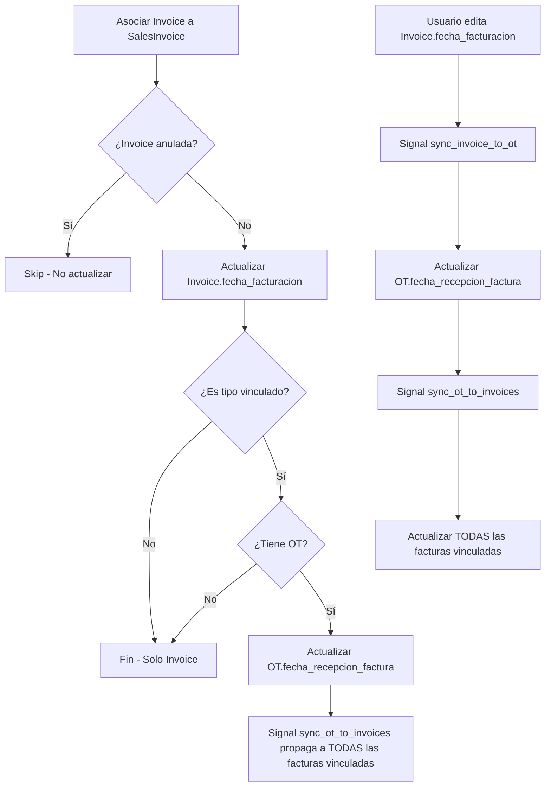

# 🧪 ANÁLISIS EXHAUSTIVO: Actualización de Fechas al Asociar Facturas de Costo a Factura de Venta

## 📋 CONTEXTO

Cuando se **asocia una factura de costo** a una **factura de venta**, se ejecuta la función `actualizar_fechas_facturas_costo_asociadas()` que:

1. **Actualiza `Invoice.fecha_facturacion`** = `SalesInvoice.fecha_emision` (SIEMPRE)
2. **Si es costo vinculado** (`FLETE`, `CARGOS_NAVIERA`):
   - Actualiza `OT.fecha_solicitud_facturacion` = `SalesInvoice.fecha_emision`
   - Actualiza `OT.fecha_recepcion_factura` = `SalesInvoice.fecha_emision`

---

## 🔍 CASOS DE PRUEBA

### CASO 1: Asociar factura de costo FLETE (vinculado a OT)

**Estado Inicial:**
```
SalesInvoice:
  - fecha_emision: 2025-01-15

Invoice (FLETE):
  - fecha_facturacion: NULL
  - tipo_costo: FLETE
  - ot: OT-001

OT-001:
  - fecha_solicitud_facturacion: NULL
  - fecha_recepcion_factura: NULL
```

**Acción:** Asociar Invoice a SalesInvoice

**Resultado Esperado:**
```
Invoice (FLETE):
  - fecha_facturacion: 2025-01-15 ✅
  - estado_facturacion: facturada ✅ (por línea 515-516 models.py)

OT-001:
  - fecha_solicitud_facturacion: 2025-01-15 ✅
  - fecha_recepcion_factura: 2025-01-15 ✅
```

**✅ CORRECTO**

---

### CASO 2: Asociar factura de costo ALMACENAJE (NO vinculado)

**Estado Inicial:**
```
SalesInvoice:
  - fecha_emision: 2025-01-15

Invoice (ALMACENAJE):
  - fecha_facturacion: NULL
  - tipo_costo: ALMACENAJE
  - ot: OT-001

OT-001:
  - fecha_solicitud_facturacion: NULL
  - fecha_recepcion_factura: NULL
```

**Acción:** Asociar Invoice a SalesInvoice

**Resultado Esperado:**
```
Invoice (ALMACENAJE):
  - fecha_facturacion: 2025-01-15 ✅
  - estado_facturacion: facturada ✅

OT-001:
  - fecha_solicitud_facturacion: NULL ✅ (NO se toca porque ALMACENAJE NO es vinculado)
  - fecha_recepcion_factura: NULL ✅
```

**✅ CORRECTO**

---

### CASO 3: ⚠️ CONFLICTO - Usuario edita fecha_facturacion en Invoice DESPUÉS de asociar

**Estado Inicial (después de asociación):**
```
Invoice (FLETE):
  - fecha_facturacion: 2025-01-15 (por asociación)
  - ot: OT-001

OT-001:
  - fecha_recepcion_factura: 2025-01-15
```

**Acción:** Usuario edita manualmente `Invoice.fecha_facturacion` a `2025-01-20`

**¿Qué pasa?**

1. **Invoice.save()** se ejecuta (línea 515-516 models.py):
   ```python
   if self.fecha_facturacion and self.estado_facturacion == 'pendiente':
       self.estado_facturacion = 'facturada'
   ```
   - ✅ `estado_facturacion` se marca como `facturada`

2. **Signal `sync_invoice_to_ot_on_assignment`** se dispara (línea 106 signals.py):
   - ❌ Este signal **NO actualiza fechas de facturación en la OT**
   - Solo ejecuta `_sincronizar_estado_con_ot()` que actualiza **estado_provision** y **fecha_provision**
   - **NO toca `OT.fecha_recepcion_factura`**

**Resultado:**
```
Invoice (FLETE):
  - fecha_facturacion: 2025-01-20 ✅

OT-001:
  - fecha_recepcion_factura: 2025-01-15 ⚠️ (DESINCRONIZADO!)
```

**🚨 PROBLEMA DETECTADO: Desincronización OT ↔ Invoice**

---

### CASO 4: ⚠️ CONFLICTO - Usuario edita fecha_recepcion_factura en OT DESPUÉS de asociar

**Estado Inicial (después de asociación):**
```
Invoice (FLETE):
  - fecha_facturacion: 2025-01-15
  - ot: OT-001

OT-001:
  - fecha_recepcion_factura: 2025-01-15
```

**Acción:** Usuario edita manualmente `OT.fecha_recepcion_factura` a `2025-01-25`

**¿Qué pasa?**

1. **OT.save()** se ejecuta
2. **Signal `sync_ot_to_invoices`** se dispara (línea 12 signals.py):
   ```python
   if instance.fecha_recepcion_factura:
       update_data['fecha_facturacion'] = instance.fecha_recepcion_factura
       update_data['estado_facturacion'] = 'facturada'
   ```
   - ✅ **TODAS** las facturas vinculadas (FLETE, CARGOS_NAVIERA) se actualizan

**Resultado:**
```
Invoice (FLETE):
  - fecha_facturacion: 2025-01-25 ✅ (SOBREESCRITO por signal!)

OT-001:
  - fecha_recepcion_factura: 2025-01-25 ✅
```

**✅ CORRECTO - La OT tiene prioridad y sincroniza hacia abajo**

---

### CASO 5: 🔥 CICLO INFINITO POTENCIAL - Editar Invoice luego OT luego Invoice...

**¿Puede ocurrir un loop infinito?**

**NO**, gracias a las banderas de control:

1. `Invoice.save()` → Signal `sync_invoice_to_ot_on_assignment`:
   - Usa flag `_skip_signal_sync` (línea 122 signals.py)
   - Solo ejecuta `_sincronizar_estado_con_ot()` que usa `_skip_invoice_sync` en la OT

2. `OT.save()` → Signal `sync_ot_to_invoices`:
   - Usa flag `_skip_invoice_sync` (línea 27 signals.py)
   - Actualiza facturas con `.update()` (NO dispara signals)

**✅ PROTECCIÓN CORRECTA contra loops infinitos**

---

### CASO 6: Asociar factura que YA tiene fecha_facturacion

**Estado Inicial:**
```
SalesInvoice:
  - fecha_emision: 2025-01-15

Invoice (FLETE):
  - fecha_facturacion: 2025-01-10 (ya tenía fecha previa)
  - ot: OT-001

OT-001:
  - fecha_recepcion_factura: 2025-01-10
```

**Acción:** Asociar Invoice a SalesInvoice

**Resultado (según opción A: sobreescribir siempre):**
```
Invoice (FLETE):
  - fecha_facturacion: 2025-01-15 ✅ (SOBREESCRITA!)

OT-001:
  - fecha_recepcion_factura: 2025-01-15 ✅ (SOBREESCRITA!)
```

**⚠️ CONSIDERACIÓN:** Se pierde la fecha original. ¿Es esto deseado?

---

### CASO 7: Asociar múltiples facturas de costo a la misma OT

**Estado Inicial:**
```
SalesInvoice:
  - fecha_emision: 2025-01-15

Invoice-A (FLETE):
  - fecha_facturacion: NULL
  - ot: OT-001

Invoice-B (CARGOS_NAVIERA):
  - fecha_facturacion: NULL
  - ot: OT-001

OT-001:
  - fecha_recepcion_factura: NULL
```

**Acción:** Asociar Invoice-A e Invoice-B a SalesInvoice

**Resultado:**
```
Invoice-A (FLETE):
  - fecha_facturacion: 2025-01-15 ✅

Invoice-B (CARGOS_NAVIERA):
  - fecha_facturacion: 2025-01-15 ✅

OT-001:
  - fecha_recepcion_factura: 2025-01-15 ✅ (actualizada 2 veces, mismo valor)
```

**✅ CORRECTO - Ambas facturas comparten la misma fecha de la factura de venta**

---

### CASO 8: ⚠️ DESASOCIAR factura de costo

**Estado Actual:**
```
Invoice (FLETE):
  - fecha_facturacion: 2025-01-15 (por asociación)
  - ot: OT-001

OT-001:
  - fecha_recepcion_factura: 2025-01-15
```

**Acción:** Usuario elimina el mapping `InvoiceSalesMapping`

**¿Qué pasa?**

- ❌ **NO hay lógica para revertir las fechas**
- Las fechas quedan como estaban

**Resultado:**
```
Invoice (FLETE):
  - fecha_facturacion: 2025-01-15 ⚠️ (queda huérfana)

OT-001:
  - fecha_recepcion_factura: 2025-01-15 ⚠️
```

**🚨 PROBLEMA POTENCIAL:** Las fechas no se limpian al desasociar

---

### CASO 9: Factura de costo vinculada a OT pero SIN OT asignada

**Estado Inicial:**
```
SalesInvoice:
  - fecha_emision: 2025-01-15

Invoice (FLETE):
  - fecha_facturacion: NULL
  - tipo_costo: FLETE
  - ot: NULL (sin OT)
```

**Acción:** Asociar Invoice a SalesInvoice

**Resultado:**
```
Invoice (FLETE):
  - fecha_facturacion: 2025-01-15 ✅
  - estado_facturacion: facturada ✅

OT:
  - (no existe, no se toca nada) ✅
```

**✅ CORRECTO - La función verifica `if factura_costo.ot:` antes de actualizar OT**

---

### CASO 10: Factura de costo anulada o rechazada

**Estado Inicial:**
```
SalesInvoice:
  - fecha_emision: 2025-01-15

Invoice (FLETE):
  - fecha_facturacion: NULL
  - estado_provision: anulada
  - ot: OT-001
```

**Acción:** Asociar Invoice a SalesInvoice

**Resultado:**
```
Invoice (FLETE):
  - fecha_facturacion: 2025-01-15 ✅ (se actualiza igual)
  - estado_provision: anulada ✅ (NO cambia)

OT-001:
  - fecha_recepcion_factura: 2025-01-15 ✅
```

**⚠️ CONSIDERACIÓN:**
- La factura anulada **SÍ se actualiza** en nuestra implementación
- Pero el signal `sync_ot_to_invoices` **EXCLUYE** facturas anuladas (línea 53 signals.py)
- Esto podría causar inconsistencias futuras

---

## 🎯 RESUMEN DE PROBLEMAS DETECTADOS

### 🔴 CRÍTICO

1. **DESINCRONIZACIÓN Invoice → OT** (CASO 3):
   - Si usuario edita `Invoice.fecha_facturacion` manualmente, la `OT.fecha_recepcion_factura` NO se actualiza
   - **Causa:** Signal `sync_invoice_to_ot_on_assignment` NO sincroniza fechas de facturación

2. **NO HAY LIMPIEZA AL DESASOCIAR** (CASO 8):
   - Al eliminar `InvoiceSalesMapping`, las fechas quedan huérfanas
   - **Causa:** No existe signal o lógica para revertir fechas al desasociar

### 🟡 ADVERTENCIA

3. **SOBREESCRITURA SIN CONFIRMAR** (CASO 6):
   - Se pierde la fecha original si ya existía
   - **Mitigation:** Documentar claramente o pedir confirmación al usuario

4. **FACTURAS ANULADAS SE ACTUALIZAN** (CASO 10):
   - Facturas anuladas reciben fechas de facturación aunque están inactivas
   - **Inconsistencia:** Signals las excluyen pero nuestra función no

---

## 💡 RECOMENDACIONES

### Fix Obligatorio:

1. **Agregar sincronización bidireccional completa Invoice ↔ OT**:
   - Signal `sync_invoice_to_ot_on_assignment` debe actualizar `OT.fecha_recepcion_factura` cuando cambia `Invoice.fecha_facturacion`

2. **Excluir facturas anuladas/rechazadas**:
   - Modificar `actualizar_fechas_facturas_costo_asociadas()` para filtrar por estado

### Fix Opcional:

3. **Signal de limpieza al desasociar**:
   - Agregar signal `post_delete` en `InvoiceSalesMapping` para limpiar fechas

4. **Validación de sobreescritura**:
   - Advertir al usuario si va a sobreescribir una fecha existente

---

## ✅ FLUJO CORRECTO ESPERADO



---

## 📝 CHECKLIST DE TESTING

- [ ] **CASO 1:** Asociar FLETE sin fechas previas → ✅ Actualiza Invoice y OT
- [ ] **CASO 2:** Asociar ALMACENAJE → ✅ Solo actualiza Invoice, NO OT
- [ ] **CASO 3:** Editar Invoice.fecha_facturacion → ⚠️ Verificar sincronización a OT
- [ ] **CASO 4:** Editar OT.fecha_recepcion_factura → ✅ Sincroniza a Invoice
- [ ] **CASO 5:** Ciclos infinitos → ✅ Flags funcionan correctamente
- [ ] **CASO 6:** Asociar con fechas previas → ⚠️ Documentar sobreescritura
- [ ] **CASO 7:** Múltiples facturas misma OT → ✅ Todas comparten fecha
- [ ] **CASO 8:** Desasociar Invoice → ⚠️ Fechas quedan huérfanas
- [ ] **CASO 9:** Sin OT asignada → ✅ Solo actualiza Invoice
- [ ] **CASO 10:** Factura anulada → ⚠️ No debería actualizarse

---

## 🔧 CÓDIGO DE FIXES SUGERIDOS

Ver documento separado: `FIXES_SINCRONIZACION_FECHAS.md`
